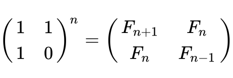
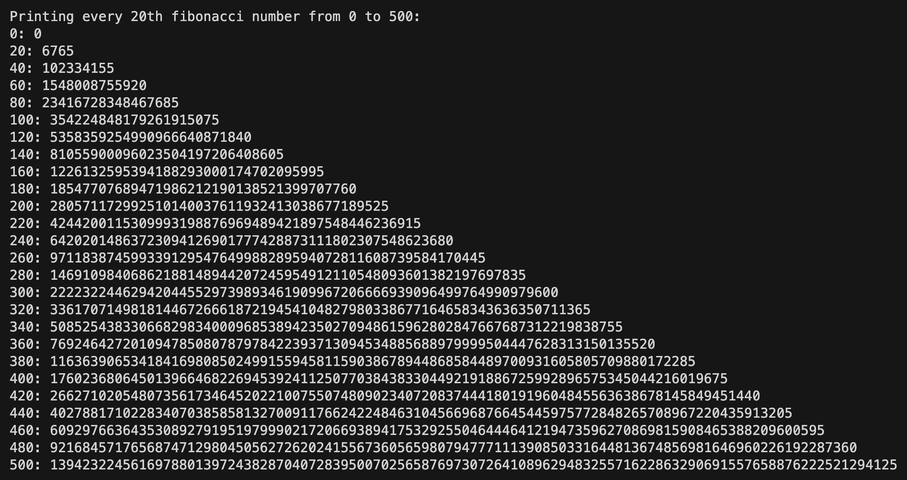

# Fibonacci number

> In mathematics, the Fibonacci numbers, commonly denoted F<sub>n</sub>, form a sequence, called the Fibonacci sequence, such that each number is the sum of the two preceding ones, starting from 0 and 1.
> [More on Wikipedia](https://en.wikipedia.org/wiki/Fibonacci_number)

### This algorithm is based on:

> The Fibonacci numbers occur as the ratio of successive convergents of the continued fraction for φ, and the matrix formed from successive convergents of any continued fraction has a determinant of +1 or −1. The matrix representation gives the following closed-form expression for the Fibonacci numbers:




### Time Complexity

The time taken by using power of the matrix is O(n).

## Compile and Run:

```
make
./main
```

## Output:


